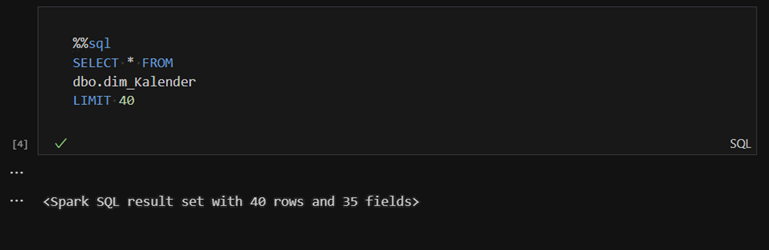
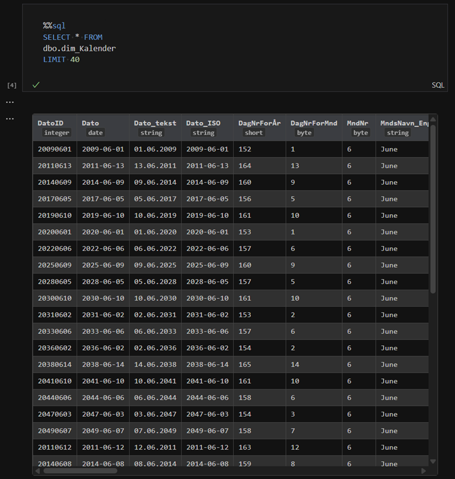

# synapse_sparksql_renderer

Source code for an extension that renders the result of the MIME-type `application/vnd.synapse.sparksql-result+json` in VS code. This extension allows the viewing of outputs related to PySpark notebooks using the `%%sql` magic command.

### Before:
A single line of text is displayed as the result.



### After:
The result is rendered as an interactive table with 20 rows, sticky headers, and resizable columns.



## Latest Release

### Version 0.3

- Improved readability across all color themes

### Version 0.2

- Added sticky headers
- Displays data type in the headers
- Vertical scrolling for more than 20 rows
- Resizable column width

### Version 0.1

- Displays the data in a non-interactive table

## Installation

### Option 0: Install by finding the extension in the VS Code marketplace

Coming as soon as I get my Azure account restored

### Option 1: Install Using a Prebuilt `.vsix` File

1. Download the latest `.vsix` file from the [Releases](https://github.com/plexion/synapse_sparksql_renderer/releases) page.
2. Open Visual Studio Code.
3. Go to the Extensions view by clicking on the Extensions icon in the Activity Bar or pressing `Ctrl+Shift+X`.
4. Click on the ellipsis (`...`) in the top-right corner of the Extensions view and select `Install from VSIX...`.
5. Select the downloaded `.vsix` file to install the extension.

### Option 2: Build from source

1. Clone the repository:
   ```bash
   git clone https://github.com/plexion/synapse-sparksql-renderer.git
   cd synapse-sparksql-renderer
   ```
2. Install the required dependencies:
   ```bash
   npm install
   ```
3. Build the renderer
   ```bash
   npm run build
   ```

4. Package the extension into a `.vsix` file:
   ```bash
   npx vsce package
   ```
   This will generate a `.vsix` file in the project directory.
5. Follow the steps in **Option 1** to install the generated `.vsix` file in Visual Studio Code.

## Usage

1. Open a PySpark notebook using the Fabric Data Engineering extension.
2. Use the `%%sql` magic command to execute Spark SQL queries.
3. The extension will automatically render the query results in a readable table format.

Example:
```python
%%sql
SELECT * FROM your_table
```

## Development Goals

- Enhance the extension to mimic the output UI experience in Microsoft Fabric for a seamless user experience.
- Have this extension deprecated when Microsoft includes a renderer in theyr Fabric Data Engineering extension

## Contributing

Contributions are welcome! To contribute raise an issue, or:

1. Fork the repository.
2. Create a new branch for your feature or bug fix:
   ```bash
   git checkout -b feature-name
   ```
3. Commit your changes:
   ```bash
   git commit -m "Description of changes"
   ```
4. Push to your branch:
   ```bash
   git push origin feature-name
   ```
5. Open a pull request.

## License

This project is licensed under the MIT License. See the [MIT License](https://github.com/plexion/synapse-sparksql-renderer/blob/main/LICENSE) for details.

## Acknowledgments

- Inspired by the need for better visualization of Spark SQL query results in PySpark notebooks and the wonderful folks over at r/MicrosoftFabric
